# ⚽ Goal Gather 


## 👩‍💻👨‍💻 개발 팀원 

- **[황승찬](https://github.com/chanee718)** : KAIST 전산학부 22학번
- **[김기현](https://github.com/surface03)** : KAIST 전산학부 22학번

## ⚙️ 개발 환경 
- Language: Flutter(Frontend), nodejs(Backend)
- OS: Android

```
minSdkVersion 21
targetSdkVersion 34
```

- IDE: Android Studio
- Target Decive: Galaxy S7
- DataBase: MySQL


## 💁 애플리케이션 설명 
- 스포츠 경기를 가게에서 같이 볼 수 있게 매칭해주는 앱입니다.
- 경기 날짜와 경기하는 팀으로 시청을 원하는 경기를 선택하여 채팅방을 개설할 수 있습니다.
- 채팅방에 위치 정보를 입력하여 근처 가게들의 정보를 받아올 수 있고, 전화를 걸 수 있습니다.
- 애플리케이션에 가게 주인이 가게 정보(빔프로젝터 여부, 수용 인원 등)들을 등록할 수 있고, 채팅방을 통해 예약할 때 이 정보들을 볼 수 있습니다.
- 채팅방 인원, 예약 시간, 예약 장소 등을 수정할 수 있습니다.
  
## 📷 스크린샷 및 기능 상세 설명

- **메인 화면**
 
    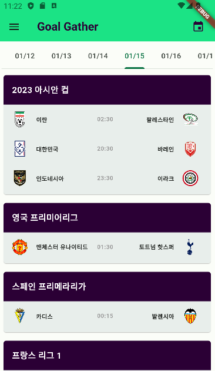
    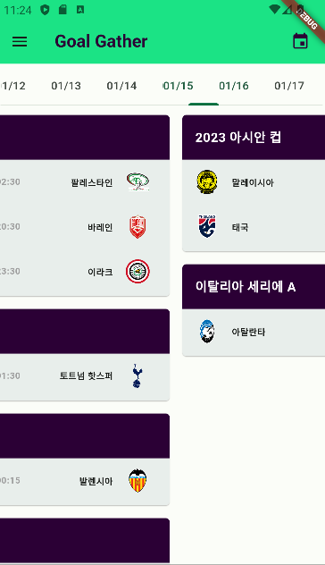

    - 각 날짜와 리그별로 경기를 분류해서 확인할 수 있습니다.
    - 각 경기를 선택하여 개설된 채팅방 정보를 확인할 수 있는 화면으로 넘어갈 수 있습니다.
    - 개설된 채팅방 정보를 확인하는 화면은 로그인을 하지 않으면 보이지 않습니다.
    - 기본적으로 현재 날짜를 기준으로 ±6일에 해당하는 날짜들을 `TabBar`를 통해 확인할 수 있고, `TabBar`의 날짜를 선택하면 선택한 날짜를 기준으로 ±6일의 정보를 볼 수 있도록 구현했습니다.
    - 상단 `AppBar`의 버튼을 눌러 다시 오늘 날짜로 돌아갈 수 있습니다.

- **사용자 정보 화면**
  
    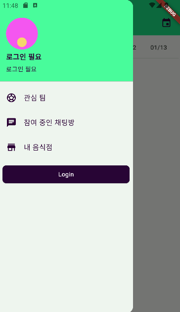
    
    - 로그인을 하면 이름과 이메일을 Drawer로부터 보이게 할 수 있습니다. 상단 왼쪽의 버튼을 선택하면 Drawer가 보이게 됩니다.
    - 처음 로그인(회원가입)을 하면 기본적인 정보를 입력하는 화면이 보이고, 정보를 입력할 수 있습니다.
    - `SharedPreferences`를 사용해서 앱을 종료하고 다시 실행해도 로그인 정보가 남아있도록 구성했습니다.

- **가게 등록 화면**
  
    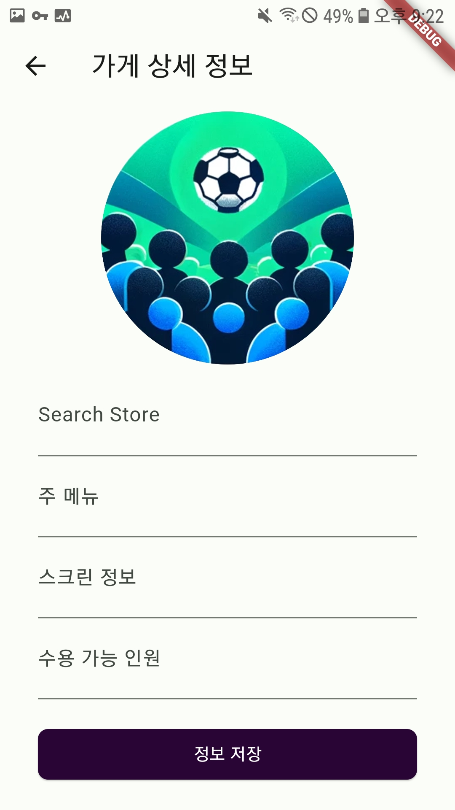
    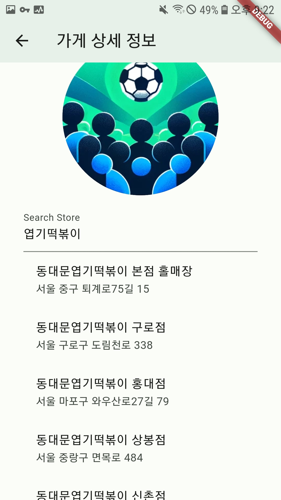

    - 가게 주인의 경우, 자신의 가게 정보를 검색하고 등록할 수 있습니다.


- **경기 정보 화면 및 채팅방 화면**
  
    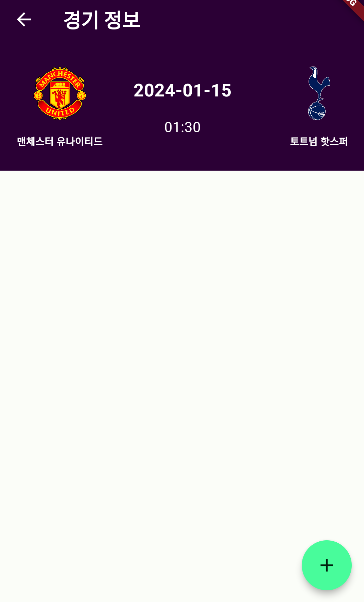
    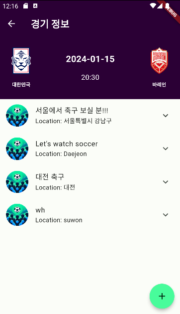
    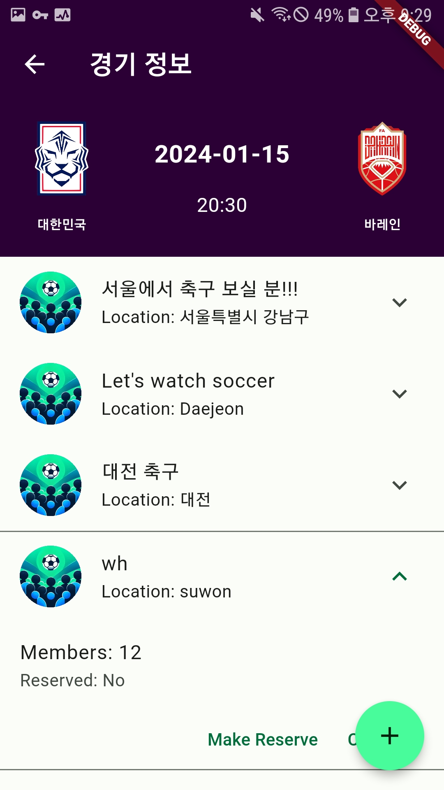
    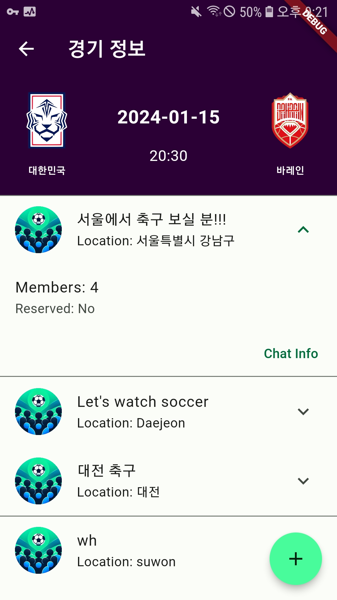
    

    - 각 경기별 개설된 채팅방 정보를 `ExpansionTile`로 보일 수 있도록 구현했습니다.
    - 내가 개설한 채팅방에 대해서는 Make Reserve 버튼을 통해 예약을 할 수 있습니다.

- **예약 화면**
  
    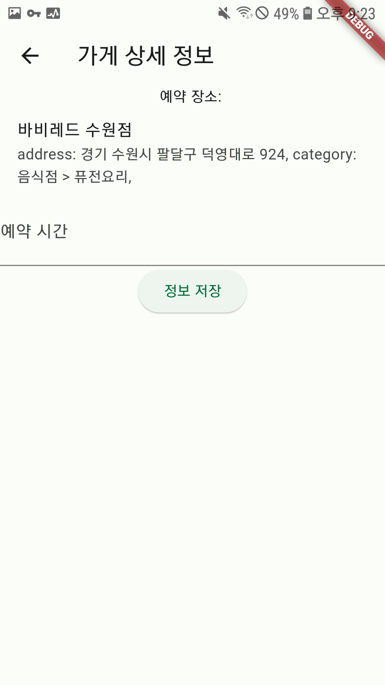

    - 채팅방에 등록한 지역 정보를 통해 주변 가게들을 보고 예약할 수 있습니다.

- **채팅방 정보 화면**
  
    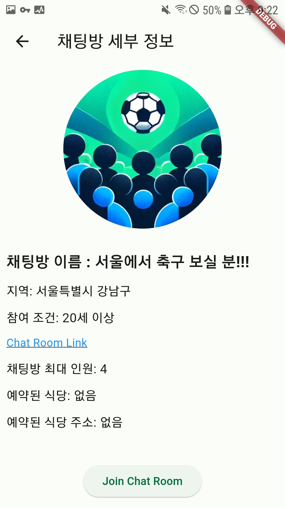
    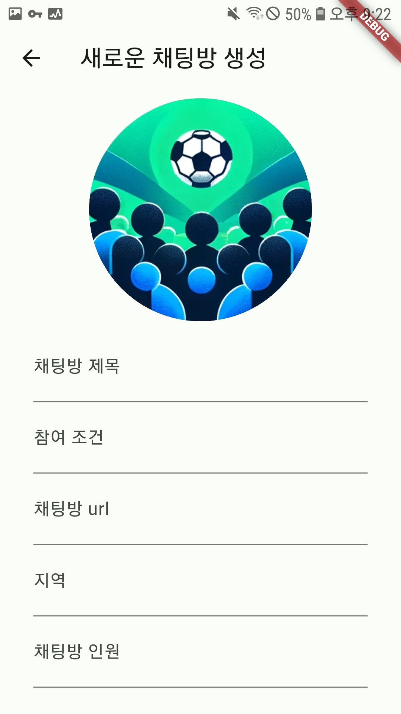

    - 채팅방 리스트에서 Chat Info버튼을 클릭하면 채팅방 이름, 개설 지역, 참여 조건, 채팅방 최대 인원, 예약된 식당 정보, 예약된 식당 주소, 채팅방 링크를 확인할 수 있는 화면이 뜨게 됩니다.
    - 채팅방을 개설한 방장의 경우, 채팅방 정보를 수정할 수 있습니다.
       

## 🛠️ 사용된 기술 

#### Frontend
- Flutter를 사용하여 앱을 구현했습니다.
- Google과 Naver API를 이용해 사용자가 로그인을 할 수 있도록 구현했고, API를 이용해 사용자의 이메일과 id 정보를 받아왔습니다. 
- Backend에서 구현된 쿼리를 이용해 사용자를 식별할 수 있는 정보인 이메일을 입력하면 사용자의 가게, 채팅방과 같은 정보들을 받아와 UI를 구성했습니다.
- Backend에서 구현된 쿼리를 이용해 각 경기별 정보와 경기 팀 로고, 경기에 관심이 있는 채팅방 정보를 받아오면 이를 이용해 UI를 구성했습니다.
- `UserAccountsDrawerHeader`를 이용해 사용자의 정보(이메일 등)를 표시하는 UI를 구성했습니다.
- Flutter의 `FutureBuilder`와 `CircularProgressIndicator`를 사용하여 Backend로부터 데이터를 받아올 때 까지 기다리고, `ListTile`과 `ExpansionTile` 등을 이용해 UI를 구성했습니다.
    
#### Backend
- MySQL로 DB를 관리하고 node.js로 서버를 구성했습니다.
- Frontend 개발을 위해 사용할 수 있는 쿼리들을 구성했습니다.
- thesportsdb API를 사용하여 경기 정보를 가져오고 DB에 저장했습니다.
- Kakao REST API를 활용해 지역이나 가게 이름으로 음식점을 검색할 수 있게 했습니다.
- 기능 구현을 위한 서버 코드와 DB를 구현했습니다.
  
